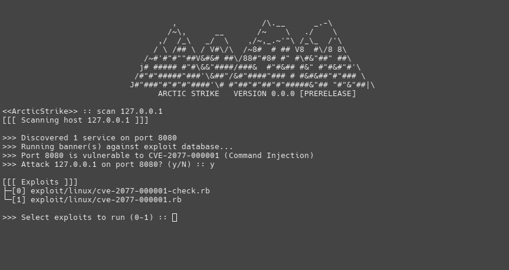

  
  <h1>Arctic Strike</h1> <b>Modular exploit development, testing, and post-exploitation framework (proof-of-concept)</b>
  

  
  <h1></h1>

This currently exists as a method for me to learn Ruby and improve my exploit development and programming abilities. It is not currently in an operational state, so use at your own dismay
